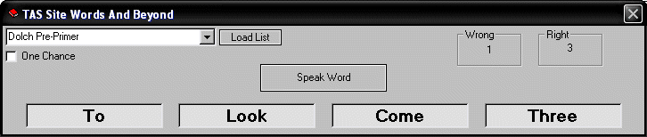



## TAS Site Words And Beyond

### Description

I wrote this program for a friend of mine with Autism to help him learn to read. It includes 18 word lists including all 5 levels of Dolch word lists. Program requires Microsoft Speech API 4.0. Uses random sorting routines to display 4 words from list then audibly says one of the words to the student. Student must then click on the same word from the four words displayed. Includes scoring. I originally found a program similar to this online and they wanted money for it. So if you need this program, here it is all you have to do is compile it. Don't forget to vote. Enjoy !!!
 
### More Info
 

             |
---                |---
**Submitted On**   |2008-05-21 18:52:28
**By**             |[Thomas Swift](https://github.com/Planet-Source-Code/PSCIndex/blob/master/ByAuthor/thomas-swift.md)
**Level**          |Beginner
**User Rating**    |5.0 (15 globes from 3 users)
**Compatibility**  |VB 6\.0
**Category**       |[Math/ Dates](https://github.com/Planet-Source-Code/PSCIndex/blob/master/ByCategory/math-dates__1-37.md)
**World**          |[Visual Basic](https://github.com/Planet-Source-Code/PSCIndex/blob/master/ByWorld/visual-basic.md)
**Archive File**   |[TAS\_Site\_W2113465212008\.zip](https://github.com/Planet-Source-Code/thomas-swift-tas-site-words-and-beyond__1-70563/archive/master.zip)

